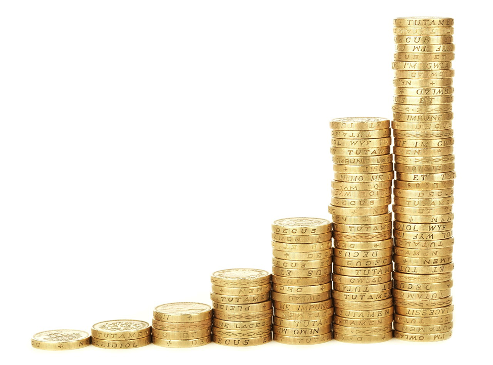
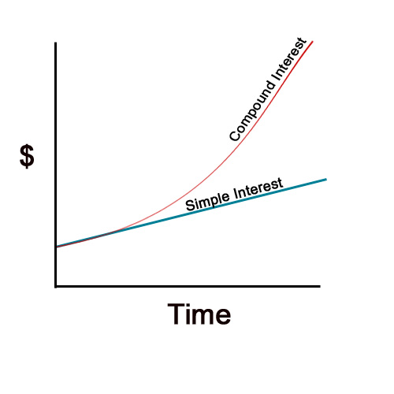

&nbsp;

&nbsp;

Hello. In this post, I will discuss about the personal finance topic of compound interest (interest on interest). The follow up to this post can be found here.

&nbsp;

**Disclaimer**

&nbsp;

I am no financial advisor. I am sharing what I know about finance based on what I have learned from financial mathematics coruses. Manage your money and funds at your own risk.

&nbsp;

### <u>Table of Contents</u>

&nbsp;

* <a href="#intro">Introduction
* <a href="#nonmath">What Is Compound Interest (Non-Math Version)
* <a href="#math">What Is Compound Interest (Math Version)
* <a href="#compound">The Impact of Compound Interest
* <a href="#examples">Examples: Financial Products Which Use Compound Interest
* <a href="#summary">Summary and Tips
* <a href="#refs">References

&nbsp;

### <u>Introduction</u>

&nbsp;

We start out with the idea that \$1 today is not the same as \$1 from 10 years ago or 10 years from now. Assuming that dollar is not from savings or a loan, the dollar is affected by inflation (or deflation) or a different currency exchange rate.

In the case of a one dollar in a savings account, a dollar now is not that same as a dollar 10 years from now. Why? It is because of compound interest. A similar argument can be made for the dollar from a loan.

The concept of compound interest is interesting in the sense on its impact on savings and loans. It is like a double edge sword with a snowball effect. It can work for you or against you. And if compound interest goes on for a long time then the snowball effect increases in magnitude significantly over time.

&nbsp;

### <u>What Is Compound Interest? (Non-Math Version)</u>

&nbsp;

Before we define compound interest, we look at interest first and other definitions.

Principal - The initial amount/capital being borrowed in a loan or invested into a savings account.

Interest - A compensation amount that the borrower pays the lender for borrowing the principal amount. The lender receives this compensation amount from the borrower (lender wants extra money for letting borrower use the money).

Interest rate - A compensation rate/percentage from the principal for the year in which the capital has been invested or borrowed.

Future Value - The value at a later point in time when the principal in the account has been affected by (compound) interest over time.

&nbsp;

---

**Example**

&nbsp;

Suppose we invest or deposit \$100 into a savings account with an interest rate of 5% per annum (year). We plan to withdraw the savings (with interest) in 3 years.

In year one:

The principal here is \$100. At the end of the first year the interest accrued or realized in the account is $(0.05) \times \$ 100 = \$ 5$. The amount in the account is now $ \$100 + \$ 5 = \$ 105$ (The formula is Principal + Accumulated Interest = New Amount)

In year two:

The principal here is \$105. At the end of the second year the interest accrued or realized in the account is $(0.05) \times \$ 105= \$ 5.25$. The amount in the account is now \$105 + \$5.25 = \$110.25.

In year three:

The principal here at the start of year three is \$110.25. At the end of the third year the interest accrued is $(0.05) \times \$ 110.25 = \$ 5.51$. The amount in the account is now \$110.25 + \$5.51 = \$115.76.

We take out our savings with the accrued interest at the end of the third year and receive the future value of \$115.76 (no deductions assumed).

Notice how each the interest at the end of the year is different. You may expect the interest to be \$5 at the year one, two and three. However, the interest amounts were \$5, \$5.25 and \$5.51. These amounts were different because we still had money in the savings account. Leaving the money into the savings reinvests the principal allowing the interest do its work on the "new principal". This reinvestment trait is a main contributor to compound interest.

In simple terms, compound interest is interest on interest.
Note that compound interest works the same way as above with loans (where you were lent money and have to pay it back with interest).

&nbsp;

### <u>What Is Compound Interest? (Math Version)</u>

&nbsp;

Here is the more technical and math oriented explanation of compound interest. Definitions of the terms are as defined in the previous section.

Compound interest is essentially interest on interest. In the mathematics sense, interest on interest is multiplying interest on interest over a period of time. Compound interest is based on exponential growth.

&nbsp;

---

&nbsp;

**Example Revisited**

&nbsp;

We revisit the example where we invest or deposit \$100 into a savings account with an interest rate of 5% per annum (year). We plan to withdraw the savings (with interest) in 3 years.

In year one:

The principal here is \$100. At the end of the first year the interest accrued or realized in the account is $(0.05) \times \$ 100 = \$ 5$. The amount in the account is now \$100 + \$5 = \$105. We can also compute the savings amount after one year as $\$ 100(1 + .05) = \$ 100(1.05) = \$105$

In year two:

The principal here is \$105. At the end of the second year the interest accrued or realized in the account is $(0.05) \times \$ 105= \$ 5.25$. The amount in the account is now \$105 + \$5.25 = \$110.25. Alternatively we can get the \$110.25 from $ \$ 100(1.05) \times (1.05) = \$ 100(1.05)^{2} = \$ 110.25$

In year three:

The future value after year three is $ \$ 100 \times (1.05)^{3} = \$ 115.76$

&nbsp;

### <u>The General Formula</u>

&nbsp;

What if we want a general formula in order to deal with different principal amounts, different interest rates, different length of time and such? The following formula will be helpful. Note that this formula assumes an annual interest rate.

&nbsp;

$$\displaystyle V(t) = P (1 + i)^{t} $$

&nbsp;

where:

&nbsp;

P: The Principal or the money initially invested into the account

V: The amount of the funds at time $t$ when the principal has been subjected to interest and time.

i: Interest rate per year (or per compounding period)

t: Number of years.

(1 + i): Growth Rate which is at least 1. Interest rates should be positive.

&nbsp;

### <u>The Impact of Compound Interest</u>

&nbsp;

We revisit the example from before again. There was \$100 in interest with an annual interest rate of 5% per annum. For years 1, 2 and 3 the future values were computed. The following chart will show more future values using the general formula from above.

&nbsp;

Year From Now | Savings (Future) Value at End of Year
------------ | -------------
1 | $100(1.05)^1 = \$105.00$
2 | $100(1.05)^2 = \$110.25$
3 | $100(1.05)^3 = \$115.76$
4 | $100(1.05)^4 = \$121.55$
5 | $100(1.05)^5 = \$127.63$
6 | $100(1.05)^6 = \$134.01$
7 | $100(1.05)^7 = \$140.71$
8 | $100(1.05)^8 = \$147.75$
9 | $100(1.05)^9 = \$155.13$
10 | $100(1.05)^{10} = \$162.89$

&nbsp;

As you can see that the growth of the savings is not increasing by \$5 every year. The interest on interest growth is exponential growth. A sample image of the compound interest growth is below:

&nbsp;

Source: http://moneytipcentral.com/what-is-compound-interest

&nbsp;

A higher initial principal gives the account a bit of a "head start" as there is a lot of funds in the account already.

A higher interest rate gives higher growth on the principal and future values.

As more time goes on, the value in the account increases significantly (steepness of curve).

&nbsp;

### <u>Examples of Financial Products Which Use Compound Interest</u>

&nbsp;

In a society which is dependent on finances, many of us deal with financial products which use compound interests. Such products include:

&nbsp;

* Registered Education Savings Plans (RESPs) [Common in Canada]
* Bonds
* Credit Card Loans
* Mortgages
* RRSPs for Retirement

&nbsp;

&nbsp;

### <u>Summary and Tips</u>

&nbsp;

- Saving early is a good idea. That way, the compound interest will work in your favor over time.

- Compound interest follows a snowball like effect. It starts small but then it can grow bigger and bigger over time. Once the snowball is big, it is hard to stop it.

- However, this assumes you have enough income to put aside for a savings account.

- When it comes to borrowing and loans. It is important to try to pay back loans as soon as possible. If loans are not paid off over time then compound interest can work against you. For example, that \$1000 loan can turn into \$10,000 with all the accumulated interest over time.

- We do not assume multiple principal payments. That would be more for annuities, another payment method.

- Be aware of fees. We assumed no fees nor deductions.

- In this post, we assumed interest rates to be annual or compounded annually. The concept of compounding semi-annually, quarterly, monthly or even continuously has not been covered here.

&nbsp;

### <u>References</u>

&nbsp;

The featured image is from http://windgatewealthmanagement.com/wp-content/uploads/2.png.

Book Reference: Financial Mathematics: A Comprehensive Treatment by Giuseppe Campolieti and Roman N. Makarov