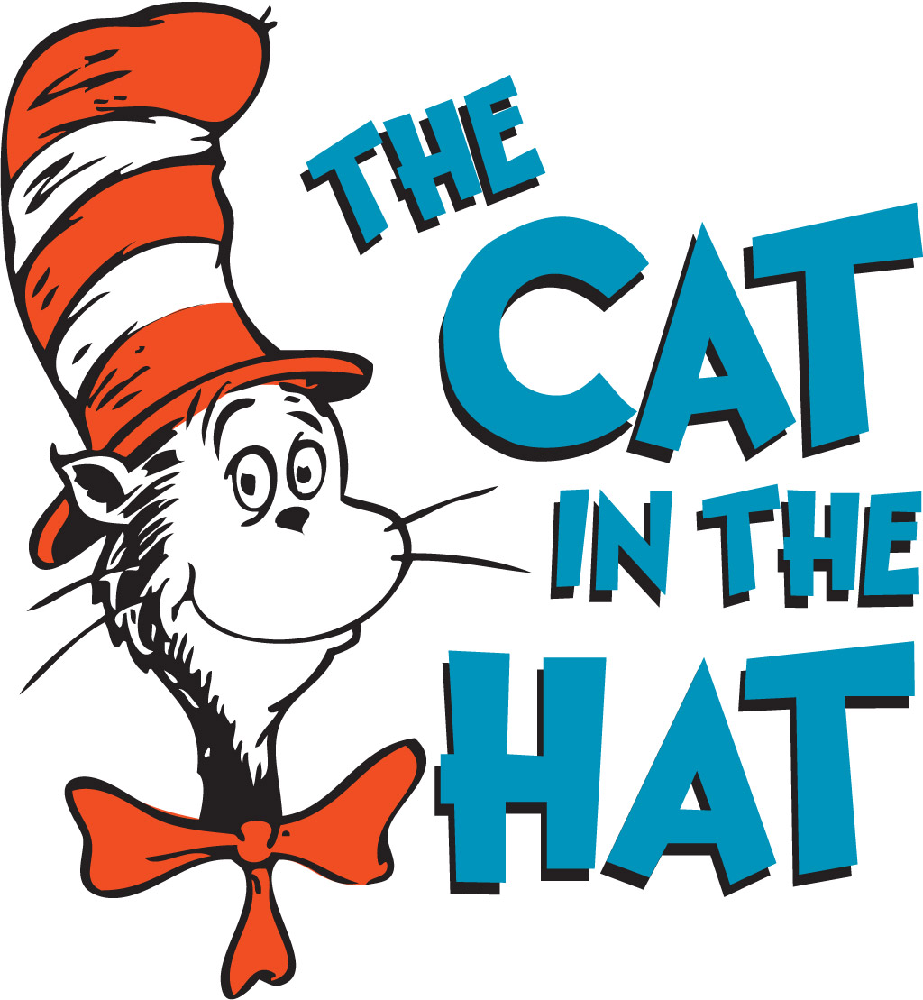

&nbsp;

Hi there. In this page, I share some experimental work in the programming language R. I use R and text analysis to analyze the words in the Dr. Seuss - The Cat In The Hat kids book.

&nbsp;

<center></center>


&nbsp;

Image Source: http://wooderice.com/wp-content/uploads/2014/04/catinthehat.jpg

&nbsp;

### <u>Sections</u>

&nbsp;

* <a href="#intro">Introduction</a>
* <a href="#wordclouds">Wordclouds On The Most Common Words In The Cat In The Hat</a>
* <a href="#common">Most Common Words Plot</a>
* <a href="#sentiment">Sentiment Analysis On The Cat In The Hat</a>
* <a href="#refs">References</a>

<a name="intro"></a>

&nbsp;

### <u>Introduction</u>

&nbsp;

A text version of the book can be found from https://github.com/robertsdionne/rwet/blob/master/hw2/drseuss.txt. The contents are copied and pasted to a different .txt file for offline use.

The R packages that are loaded in are:

* dplyr
* tidyr
* ggplot2
* tidytext
* wordcloud
* tm

&nbsp;

```{r}
# Text Mining on the Dr. Seuss - The Cat In The Hat Kids Book

# Text Version Of Book Source: 
# https://github.com/robertsdionne/rwet/blob/master/hw2/drseuss.txt

# 1) Wordclouds 
# 2) Word Counts 
# 3) Sentiment Analysis - nrc, bing and AFINN Lexicons

#----------------------------------

# Load libraries into R:
# Install packages with install.packages("pkg_name")

library(dplyr)
library(tidyr)
library(ggplot2)
library(tidytext)
library(wordcloud)
library(tm)
```

&nbsp;


<a name="wordclouds"></a>

&nbsp;

### <u>Wordclouds Of The Most Common Words In The Cat In The Hat Book</u>

&nbsp;

To start, I load in the The Cat In The Hat book from the offline text file with the `readLines()` function. Afterwards, the `readLines()` object is put into a VectorSource and then into a Corpus.

Once you have the Corpus object, the `tm_map()` functions can be used to clean up the text. Options include removing punctuations, converting text to lowercase, removing numbers, removing whitespace and removing stopwords (words like the, and, or, for, me).

&nbsp;

```{r}
# 1) Wordclouds
# Reference: http://www.sthda.com/english/wiki/text-mining-and-word-cloud-fundamentals-in-r-5-simple-steps-you-should-know
# Ref 2: https://www.youtube.com/watch?v=JoArGkOpeU0

catHat_book <- readLines("cat_in_the_hat_textbook.txt")

catHat_text <- Corpus(VectorSource(catHat_book))

# Clean the text up:

catHat_clean <- tm_map(catHat_text, removePunctuation)
catHat_clean <- tm_map(catHat_clean, content_transformer(tolower))
catHat_clean <- tm_map(catHat_clean, removeNumbers)
catHat_clean <- tm_map(catHat_clean, stripWhitespace)

# Remove English stopwords such as: the, and or, over, under, and so on:

catHat_clean <- tm_map(catHat_clean, removeWords, stopwords('english'))
```


&nbsp;

The next step is to convert the `tm_map()` object in a Term Document Matrix and then into a data frame. Once a data frame is obtained, wordclouds along with bar graphs can be generated.

&nbsp;

```{r}
# Convert to Term Document Matrix:

td_mat<- TermDocumentMatrix(catHat_clean)
matrix <- as.matrix(td_mat)
sorted <- sort(rowSums(matrix),decreasing=TRUE)
data_text <- data.frame(word = names(sorted), freq = sorted)

#Preview data:
head(data_text, 30)
```

&nbsp;

The `wordcloud()` function from the wordcloud package allows for the generation of a colourful wordcloud as shown below.

&nbsp;

```{r, echo = TRUE, fig.width=4, fig.height=4}
# Wordcloud with colours:

set.seed(1234)
wordcloud(words = data_text$word, freq = data_text$freq, min.freq = 5,
max.words = 100, random.order=FALSE, rot.per=0.35, 
colors = rainbow(30))
```

&nbsp;


To make the wordcloud smaller you can raise the minimum frequency requirement for words by changing the value of the min.freq argument in `wordcloud()`.

&nbsp;

```{r, echo = TRUE, fig.width=4, fig.height=4} 
# Wordcloud with colours with lower max words and raise minimum frequency:

wordcloud(words = data_text$word, freq = data_text$freq, min.freq = 15,
 max.words = 80, random.order=FALSE, rot.per=0.35, 
 colors = rainbow(30))
```

&nbsp;


It appears that the word like is the most common along with the words will, sir, fish, things and grinch.

<a name="common"></a>

&nbsp;

### <u>The Most Common Words In The Cat In The Hat Book</u>

&nbsp;

In my other text mining/analysis projects in R pages, I use the tidytext approach with the tidytext package and the `unnest_tokens()` function to obtain the most common words in the The Cat In The Hat book. However, in this page I still use code from the previous section. The `data_text` object is already preprocessed with the `tm_map()` functions and is ready for plotting with ggplot2.

I take the top 25 most common words from The Cat In The Hat book. To obtain the bars, you need the `geom_col()` function. Sideways bars can be obtained with the `coord_flip()` addon function. Labels and text can be added with the `labs()` function and the geom_text function respectively. The `theme()` function allows for adjustment of aesthetics such as text colours, text sizes and so forth.

&nbsp;

```{r, echo = TRUE, fig.width=4, fig.height=4}
# Wordcounts Plot:

# ggplot2 bar plot (Top 25 Words)

data_text[1:25, ] %>% 
    mutate(word = reorder(word, freq)) %>% 
    ggplot(aes(word, freq)) + 
    geom_col(fill = "lightblue") +
    coord_flip() +
    labs(x = "Word \n", y = "\n Count ", title = "Word Counts In \n The Cat In The Hat Book \n (Top 25) \n") +
    geom_text(aes(label = freq), hjust = 1.2, colour = "black", fontface = "bold", size = 3.7) +
    theme(plot.title = element_text(hjust = 0.5, colour = "darkgreen", size = 15), 
          axis.title.x = element_text(face="bold", colour="darkblue", size = 12),
          axis.title.y = element_text(face="bold", colour="darkblue", size = 12), 
          panel.grid.major = element_blank(),
          panel.grid.minor= element_blank())
```

&nbsp;


In the wordclouds, you were unable to determine the counts associated with each word. With the bar graph with numeric texts, you can clearly see the counts with the words.

The most common words in The Cat In The Hat include like, will, said, sir, one, fish and say.

<a name="sentiment"></a>

&nbsp;

### <u>Sentiment Analysis</u>

&nbsp;

Sentiment analysis looks at a piece of text and determines whether the text is positive or negative (depending on the lexicon). Three lexicons are used here for analyzing words.

Do keep in mind that each lexicon has its own way of scoring the words in terms of positive/negative sentiment. In addition, some words are in certain lexicons and some words are not. These lexicons are not perfect as they are subjective with the scoring.

I read in the book into R (again) and convert the book into a tibble (neater data frame). The `head()` function is used to preview/check the start of the book.

&nbsp;

```{r}
# 3) Sentiment Analysis 
# Is the book positive, negative, neutral?

catHat_book <- readLines("cat_in_the_hat_textbook.txt")

# Preview the start of the book:

catHat_book_df <- data_frame(Text = catHat_book) # tibble aka neater data frame

head(catHat_book_df, n = 15)
```

&nbsp;


The `unnest_tokens()` function is then applied on the `data_frame()` object. Each word in The Cat In The Hat now has its own row. An `anti_join()` is used to remove English stop words such as the, and, for, my, myself. A `count()` function is used to obtain the counts for each word with the `sort = TRUE` argument.

&nbsp;

```{r}
catHat_book_words <- catHat_book_df %>% 
unnest_tokens(output = word, input = Text)

# Retrieve word counts as set up for sentiment lexicons:

catHat_book_wordcounts <- catHat_book_words %>%
                            anti_join(stop_words) %>% 
                            count(word, sort = TRUE)
```
&nbsp;

**nrc Lexicon**

&nbsp;

The nrc Lexicon categorizes words as either having the sentiment of trust, fear, negative, sadness, fear, anger or positive. Here, the sentiments of interest from the nrc lexicon are negative and positive.

&nbsp;

```{r}
#### Using nrc, bing and AFINN lexicons

word_labels_nrc <- c(
`negative` = "Negative Words",
`positive` = "Positive Words"
)

### nrc lexicons:
# get_sentiments("nrc")

catHat_book_words_nrc <- catHat_book_wordcounts %>%
                          inner_join(get_sentiments("nrc"), by = "word") %>%
                          filter(sentiment %in% c("positive", "negative"))

# Preview common words with sentiment label:

head(catHat_book_words_nrc, n = 12)
```

&nbsp;

Here is the code and output for the word counts influenced by the nrc Lexicon for The Cat In The Hat book. There is a lot of code in the section below as I wanted to make the plot look nicer than usual.

&nbsp;

```{r, echo = TRUE, fig.width=4, fig.height=4} 
# Sentiment Plot with nrc Lexicon (Word Count over 5)

catHat_book_words_nrc %>%
          filter(n > 5) %>%
          ggplot(aes(x = reorder(word, n), y = n, fill = sentiment)) + 
          geom_bar(stat = "identity", position = "identity") +
          geom_text(aes(label = n), colour = "black", hjust = 1, fontface = "bold", size = 3) +
          facet_wrap(~sentiment, nrow = 2, scales = "free_y", labeller = as_labeller(word_labels_nrc)) +
          labs(x = "\n Word \n", y = "\n Word Count ", title = "Negative & Positive Words In \n The Cat In The Hat Kids' Book \n With The nrc Lexicon \n") +
          theme(plot.title = element_text(hjust = 0.5), 
                axis.title.x = element_text(face="bold", colour="darkblue", size = 12),
                axis.title.y = element_text(face="bold", colour="darkblue", size = 12),
                strip.background = element_rect(fill = "lightblue"),
                strip.text.x = element_text(size = 10, face = "bold")) +
                scale_fill_manual(values=c("#FF0000", "#01DF3A"), guide=FALSE) + 
                coord_flip()
```

&nbsp;


**bing Lexicon**

&nbsp;

Words under the bing lexicon categorizes certain words as either positive or negative. In the bar plot below, you will see that the selected top words are different than the ones from the nrc lexicon. (These lexicons are subjective.)

&nbsp;

```{r}
### bing lexicon:
# get_sentiments("bing")
 
word_labels_bing <- c(
              `negative` = "Negative Words",
              `positive` = "Positive Words"
 )

catHat_book_words_bing <- catHat_book_wordcounts %>%
    inner_join(get_sentiments("bing"), by = "word") %>%
    ungroup()

# Preview the words and counts:

head(catHat_book_words_bing, n = 15)
```

&nbsp;

```{r, echo = TRUE, fig.width=4, fig.height=4}
# Sentiment Plot with bing Lexicon (Counts over 3):

catHat_book_words_bing %>%
      filter(n > 3) %>%
      ggplot(aes(x = reorder(word, n), y = n, fill = sentiment)) +
      geom_bar(stat = "identity", position = "identity") +
      geom_text(aes(label = n), colour = "black", hjust = 1, fontface = "bold", size = 3) +
      facet_wrap(~sentiment, nrow = 2, scales = "free_y", labeller = as_labeller(word_labels_bing)) +
      labs(x = "\n Word \n", y = "\n Word Count ", title = "Negative & Positive Words In \n The Cat In The Hat Kids' Book \n With The bing Lexicon \n") +
      theme(plot.title = element_text(hjust = 0.5),
            axis.title.x = element_text(face="bold", colour="darkblue", size = 12),
            axis.title.y = element_text(face="bold", colour="darkblue", size = 12),
            strip.background = element_rect(fill = "#BEE1D3"),
            strip.text.x = element_text(size = 10, face = "bold", colour = "black")) +
            scale_fill_manual(values=c("#FF0000", "#01DF3A"), guide=FALSE) +
            coord_flip()
```

&nbsp;

The top negative word according to bing is bump. Other intriguing negative words include sue, funny, trick and noise. The word sue is either a verb as in to sue someone or it could be a name. I am not sure if I agree funny being a negative word. The word trick can be used as a verb as in to trick someone or as a noun such as a magic trick. Bing interprets trick more as a verb I presume.

&nbsp;

**AFINN Lexicon**

&nbsp;

Words from the AFINN lexicon are given a score from -5 to + 5 (whole numbers only). Scores below zero are for negative words and positive numbers are for positive words. I have used the `mutate()` function from R's dplyr package to add a new column which indicates whether a word is positive or negative. This extra column helps in creating separate plots into one plot under `ggplot2`.

&nbsp;

```{r, echo = TRUE, fig.width=4, fig.height=4} 
### AFINN lexicon:

# Change labels 
# (Source: https://stackoverflow.com/questions/3472980/ggplot-how-to-change-facet-labels)

catHat_book_words_AFINN <- catHat_book_wordcounts %>%
                inner_join(get_sentiments("afinn"), by = "word") %>%
                mutate(is_positive = score > 0) 

head(catHat_book_words_AFINN, n = 15)

word_labels_AFINN <- c(
  `FALSE` = "Negative Words",
  `TRUE` = "Positive Words"
)

catHat_book_words_AFINN %>%
  filter(n > 3) %>%
  ggplot(aes(x = reorder(word, n), y = n, fill = is_positive)) + 
  geom_bar(stat = "identity", position = "identity") +
  geom_text(aes(label = n), colour = "black", hjust = 1, fontface = "bold", size = 3.2) +
  facet_wrap(~is_positive, scales = "free_y", nrow = 2, labeller = as_labeller(word_labels_AFINN)) +
  labs(x = "\n Word \n", y = "\n Word Count ", title = "Negative & Positive Words In \n The Cat In The Hat Kids' Book \n With The AFINN Lexicon  \n",
       fill = c("Negative", "Positive")) +
  theme(plot.title = element_text(hjust = 0.5), 
        axis.title.x = element_text(face="bold", colour="darkblue", size = 12),
        axis.title.y = element_text(face="bold", colour="darkblue", size = 12),
        strip.background = element_rect(fill = "#D5ADA4"),
        strip.text.x = element_text(size = 10, face = "bold", colour = "black")) +
  scale_fill_manual(values=c("#FF0000", "#01DF3A"), guide=FALSE) + 
  coord_flip()
```

&nbsp;

Under AFINN, the most negative word is battle and the most positive word is fun. The word fun is featured in all three lexicons and the "negative" word bad is featured in all three as well. As different as these lexicons are in terms of categorization, there are a few common words between the three lexicons.

The nrc lexicon scores the The Cat In The Hat book more positively than bing and AFINN. bing gives the book a more negative score overall and the AFINN results are fairly balanced.

<a name="refs"></a>

&nbsp;

### <u>References</u>

&nbsp;

* R Graphics Cookbook By Winston Chang
* Text Mining With R: A Tidy Approach By Julia Silge & David Robinson
* http://www.sthda.com/english/wiki/text-mining-and-word-cloud-fundamentals-in-r-5-simple-steps-you-should-know
* https://www.youtube.com/watch?v=JoArGkOpeU0
* https://github.com/robertsdionne/rwet/blob/master/hw2/drseuss.txt
* https://stackoverflow.com/questions/3472980/ggplot-how-to-change-facet-labels