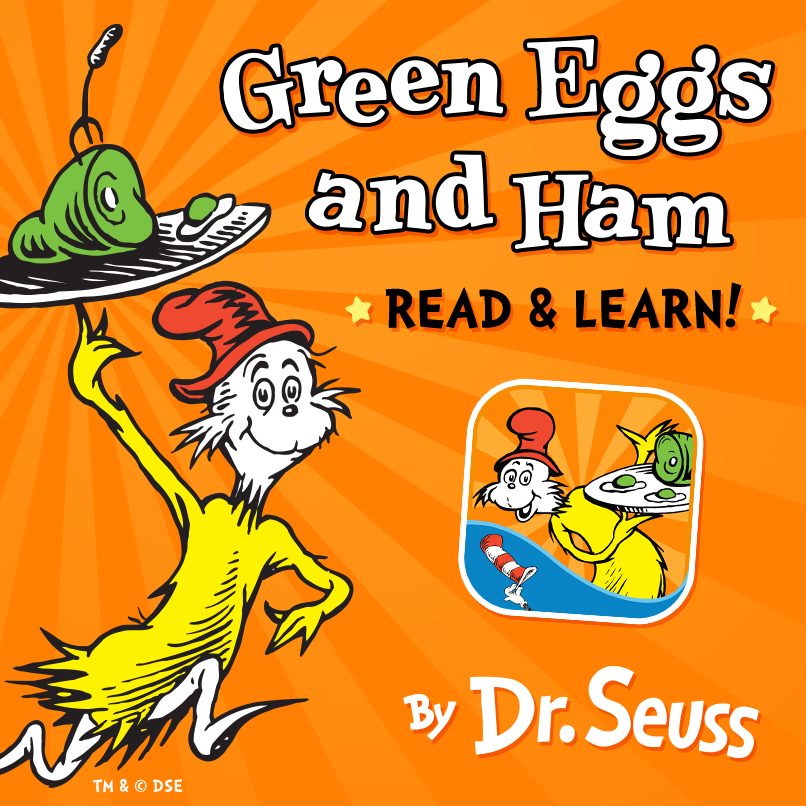

&nbsp;

Hi there. In this page, I use the R programming language to do text analysis and text mining to obtain wordcounts and wordclouds from the Dr. Seuss - Green Eggs & Ham book. The topic of bigrams (two word phrases) is not discussed here this time around.

&nbsp;

<center></center>

&nbsp;

Source: http://mommyneedsabottle.com/wp-content/uploads/2015/08/GreenEggs_Ad.png

&nbsp;

### <u>Sections</u>

&nbsp;

* <a href="#intro">Introduction & Getting Started</a>
* <a href="#wordclouds">Wordcounts & Wordclouds In Green Eggs & Ham</a>
* <a href="#generate">Generating The Plots</a>
* <a href="#combine">Combining The Bar Plots Into One Graph With grid.arrange()</a>
* <a href="#refs">References & Resources</a>

<a name="intro"></a>

&nbsp;

### <u>Introduction & Getting Started</u>

&nbsp;

One of the first children's book I was introduced to was Dr. Seuss - Green Eggs & Ham. I would read this book a lot at the doctor's office when I was young.

A .txt version of the book can be found online through this link. Since there is no title or weird characters, there is no need for data cleaning in R.

Wordcounts and wordclouds are generated in the tidy way as described from the (online) book Text Mining With R: A Tidy Approach by Julia Silge and David Robinson.


&nbsp;

**Loading Libraries In R**

&nbsp;

The R packages of interest are `dplyr`, `tidyr`, `ggplot2`, `tidytext`, `wordcloud` and `gridExtra`.

&nbsp;

```{r}
# Load libraries into R:
# Install packages with install.packages("pkg_name")

library(dplyr) # Data Manipulation
library(tidyr) # Data Wrangling
library(ggplot2) # Data Visualization
library(tidytext) # For text mining and analysis
library(wordcloud) # Wordcloud capabilities
library(gridExtra) # Multiple plots in one
```

<a name="wordclouds"></a>

&nbsp;

### <u>Wordcounts & Wordclouds In Green Eggs & Ham</u>

&nbsp;

With the `tidytext` package in R, you can obtain wordcounts from pieces of text. To be able to generate wordclouds, you would require the wordcloud R package. My other text mining posts mention creating wordclouds with the use of the tm package but in this case I am using the tidytext and wordcloud packages.

There is a text version of the Green Eggs & Ham book online here. This text file is the book itself so there is no need for data cleaning. To read in the file, use the `readLines()` function in R.

&nbsp;

```{r}
# 1) Wordcounts in Green Eggs And Ham

greenEggs_book <- readLines("https://www.clear.rice.edu/comp200/resources/texts/Green%20Eggs%20and%20Ham.txt")

# Preview the start of the book:

greenEggs_book_df <- data_frame(Text = greenEggs_book) # tibble aka neater data frame

head(greenEggs_book_df, n = 15) 
```

&nbsp;

From the tidytext package, the `unnest_tokens()` function converts the text in a way such that each row is just a single word.

&nbsp;

```{r}
# Unnest tokens: Have each word in a row:

greenEggs_words <- greenEggs_book_df %>% 
  unnest_tokens(output = word, input = Text) 

# Preview with head() function:

head(greenEggs_words, n = 10)
```

&nbsp;

Normally, I want to remove stopwords from the text as they carry very little meaning on their own. This time around, I will obtain word counts in Green Eggs & Ham when the stopwords are filtered out and the word counts of the original book itself. To filter out the stop words the `anti_join()` function from R's dplyr package is used. The variable which is associated with the filtered text is `greenEggs_words_filt`.

&nbsp;

```{r}
# Remove English stop words from Fox In Socks:
# Stop words include me, you, for, myself, he, she

greenEggs_words_filt <- greenEggs_words %>%
  anti_join(stop_words)
```

&nbsp;

With the use of dplyr's pipe operator (%>%) and its `count()` function, counts for each word can be obtained for the filtered case and the non-filtered case.

&nbsp;

```{r}
# Word Counts in Fox In Socks (No stopwords)

greenEggs_wordcounts <- greenEggs_words %>% count(word, sort = TRUE)

# Word Counts in Fox In Socks (Stopwords removed)

greenEggs_wordcounts_filt <- greenEggs_words_filt %>% count(word, sort = TRUE)

# Print top 15 words

head(greenEggs_wordcounts, n = 15)

head(greenEggs_wordcounts_filt, n = 15)
```
&nbsp;

<a name="generate"></a>

### <u>Generating The Plots</u>

&nbsp;

**Case One: Wordcounts Plot and Wordcloud With Stopwords**

Plots are generated with the use of R's ggplot2 data visualization package. The plots are saved into variables which will be used the `grid.arrange()` function later for multiple plots.

From the unfiltered version, I take the top 15 most common words in the Green Eggs & Ham book. The results from the plot are not too inspiring besides the name sam.

&nbsp;

```{r, echo = TRUE, fig.width=4, fig.height=4} 
## a) Plot & Wordcloud With StopWords

# Bar Graph (Top 15 Words):

green_wordcounts_plot <- greenEggs_wordcounts[1:15, ] %>% 
                          mutate(word = reorder(word, n)) %>% 
                          ggplot(aes(word, n)) + 
                          geom_col(fill = "#807af5") +
                          coord_flip() +
                          labs(x = "Word \n", y = "\n Count ", title = "The 15 Most Common Words In \n Green Eggs And Ham \n") +
                          geom_text(aes(label = n), hjust = 1, colour = "white", fontface = "bold", size = 3.5) +
                          theme(plot.title = element_text(hjust = 0.5), axis.ticks.x = element_blank(),
                          axis.title.x = element_text(face="bold", colour="darkblue", size = 12),
                          axis.title.y = element_text(face="bold", colour="darkblue", size = 12)) 

# Print plot:

green_wordcounts_plot
```

&nbsp;


Most of the preprocessing has already been done with the dplyr functions. Generating the wordcloud does not take much extra code.

&nbsp;


```{r, echo = TRUE, fig.width=4, fig.height=4} 
# Wordcounts Wordcloud:

greenEggs_wordcounts %>%
  with(wordcloud(words = word, freq = n, min.freq = 2, max.words = 100, random.order=FALSE, rot.per=0.35, colors = rainbow(30)))
```

&nbsp;

**Case Two: Wordcounts Plot and Wordcloud Without Stopwords**

&nbsp;

The code is not much different from case one. In this case, the filtered version of the word counts is used.

&nbsp;

```{r, echo = TRUE, fig.width=4, fig.height=4} 
## b) Plot & Wordcloud With No StopWords

# Bar Graph (Top 15 Words):

green_wordcounts_plot_filt <- greenEggs_wordcounts_filt[1:15, ] %>% 
  mutate(word = reorder(word, n)) %>% 
  ggplot(aes(word, n)) + 
  geom_col(fill = "#d9232f") +
  coord_flip() +
  labs(x = "Word \n", y = "\n Count ", title = "The 15 Most Common Words In \n Green Eggs And Ham \n (No Stopwords) \n") +
  geom_text(aes(label = n), hjust = 1, colour = "white", fontface = "bold", size = 3.5) +
  theme(plot.title = element_text(hjust = 0.5), 
        axis.ticks.x = element_blank(),
        axis.title.x = element_text(face="bold", colour="darkblue", size = 12),
        axis.title.y = element_text(face="bold", colour="darkblue", size = 12)) 

# Print plot:

green_wordcounts_plot_filt
```

&nbsp;

From the results, top words include:

&nbsp;

* eat
* sam
* green
* eggs
* ham
* mouse
* house
* fox

&nbsp;

These top words indicate that the book has something to do with sam, eggs, ham, eating and the colour green.

Generating the wordcloud in R with the `wordcloud` package is not much different as in the first case.

&nbsp;

```{r, echo = TRUE, fig.width=4, fig.height=4} 
# Wordcounts Wordcloud:

greenEggs_wordcounts_filt %>%
  with(wordcloud(words = word, freq = n, min.freq = 2, max.words = 100, random.order=FALSE, rot.per=0.35, colors = rainbow(30)))
```

<a name="combine"></a>

&nbsp;

### <u>Combining The Bar Plots Into One Graph With grid.arrange()</u>

The horizontal bar graphs from earlier were saved into variables. From the gridExtra package in R, the two variables containing the plots can be used in the grid.arrange() function to generate a plot with multiple graphs.

&nbsp;

```{r, echo = TRUE, fig.width=7, fig.height=7} 
## Bar graphs together

grid.arrange(green_wordcounts_plot, green_wordcounts_plot_filt, ncol = 2)
```

&nbsp;

There is a clear and definite difference with the graphs when the English stopwords such as I, the, of, will and with are removed. The results carry more meaning.

<a name="refs"></a>

&nbsp;

### <u>References & Resources</u>

&nbsp;

* R Graphics Cookbook By Winston Chang
* Text Mining With R: A Tidy Approach By Julia Silge and David Robinson
* https://www.clear.rice.edu/comp200/resources/texts/Green%20Eggs%20and%20Ham.txt
* http://www.sthda.com/english/wiki/text-mining-and-word-cloud-fundamentals-in-r-5-simple-steps-you-should-know