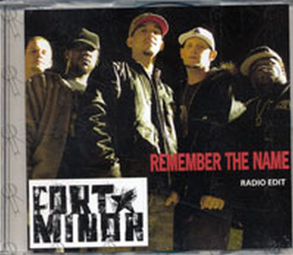

&nbsp;

Hi there. In this page, I share some work in the R programming language where I analyze rap lyrics. The rap lyrics are analyzed with text mining. Results are shared through code output and plots.

References include the R Graphics Cookbook by Winston Chang and Text Mining with R - A Tidy Approach by Julia Silge and David Robinson. Lyrics were taken from a lyrics website (azlyrics.com I think).

&nbsp;

### <u>Sections</u>

&nbsp;

* <a href="#intro">Introduction</a>
* <a href="#remember">Fort Minor - Remember The Name Lyrics Analysis</a>
* <a href="#lose-yourself">Eminem - Lose Yourself Lyrics Analysis</a>

<a name="intro"></a>

&nbsp;

### <u>Introduction</u>

&nbsp;

Looking at rap music is one option when it comes to analyzing text. Rap lyrics generally contain more words than other musical genres.

In this page, I share some experimental work in the R programming language where I analyze rap lyrics from the tracks Fort Minor - Remember The Name and Eminem - Lose Yourself.

The R packages that I use are dplyr for data wrangling and data manipulation, `ggplot2` for plotting results, `tidytext` for text analysis, and `tidyr` for data cleaning and data formatting.

&nbsp;

```{r}
# Load libraries into R:

library(dplyr)
library(ggplot2)
library(tidytext)
library(tidyr)
```

<a name="remember"></a>

&nbsp;

### <u>Fort Minor - Remember The Name Lyrics Analysis</u>

&nbsp;

The artist Fort Minor was a side project from the Linkin Park member Mike Shinoda. Mike sometimes provides vocals in the form of rapping in a few of the Linkin Park tracks. Fort Minor's Remember The Name single was released in 2005 and was featured in the video game NBA Live 06, the 2006 & 2007 NBA Playoffs and in the 2008 NBA draft.

&nbsp;

<center></center>

&nbsp;

Source: https://www.rarerecords.com.au/wp-content/uploads/2016/05/FORT-MINOR-Remember-The-Name.jpg

&nbsp;

```{r}
### 1) Fort Minor - Remember The Name

# Read Fort Minor - Remember The Name lyrics into R:

remember_lyrics <- readLines("fortMinor_rememberTheName_lyrics.txt")

# Preview the lyrics:

remember_lyrics_df <- data_frame(Text = remember_lyrics) # tibble aka neater data frame

head(remember_lyrics_df, n = 10)
```

&nbsp;

The key function that will help in obtaining word counts is the `unnest_tokens()` function. Each word from the song lyrics will be in a row.

&nbsp;

```{r}
# Unnest tokens: each word in the lyrics in a row:

remember_words <- remember_lyrics_df %>% 
unnest_tokens(output = word, input = Text)

# Preview with head() function:

head(remember_words, n = 10)
```

&nbsp;

<u>**Word Counts In Fort Minor - Remember The Name**</u>

&nbsp;

There are words in the English language that do not offer much meaning on its own but it helps make sentences flow. These words are called stop words. An `anti_join()` from the dplyr package in R is used to remove stop words from the Remember The Name lyrics.

&nbsp;

```{r}
### 1a) Word Counts in Remember The Name:

# Remove English stop words from Remember The Name:
# Stop words include the, and, me , you, myself, of, etc.

remember_words <- remember_words %>%
anti_join(stop_words)
```

&nbsp;

The `count()` function is used to obtain the words counts. These results are plotted as a sideways bar graph with the ggplot2 package functions.

&nbsp;

```{r, echo = TRUE, fig.width=6, fig.height=6}
# Word Counts:

remember_wordcounts <- remember_words %>% count(word, sort = TRUE)

head(remember_wordcounts, n = 15)

# Plot of Word Counts (Top 15 Words):

remember_wordcounts[1:15, ] %>% 
  mutate(word = reorder(word, n)) %>% 
  ggplot(aes(word, n)) + 
  geom_col(fill = "red") +
  coord_flip() +
  labs(x = "Word \n", y = "\n Count ", title = "Word Counts In \n Fort Minor - Remember The Name \n") +
  geom_text(aes(label = n), hjust = 1.2, colour = "white", fontface = "bold") +
  theme(plot.title = element_text(hjust = 0.5), 
        axis.title.x = element_blank(),
        axis.ticks.x = element_blank(),
        axis.text.x = element_blank(),
        axis.title.y = element_text(face="bold", colour="darkblue", size = 12))
```

&nbsp;

In Fort Minor - Remember The Name, the word percent is used a lot. The word skill comes in at second place with a count of 6. Other common words include number words, reason, power, pleasure, and pain. These common words pretty much come from the chorus.

&nbsp;

```
This is ten percent luck, twenty percent skill,

Fifteen percent concentrated power of will

Five percent pleasure, fifty percent pain

And a hundred percent reason to remember the name!
```
&nbsp;

<u>**Bigrams: Two Word Phrases**</u>

&nbsp;

```{r}
### 1b) Bigrams (Two-Word Phrases) in Remember The Name:

remember_bigrams <- remember_lyrics_df %>% 
unnest_tokens(bigram, input = Text, token = "ngrams", n = 2)

# Look at the bigrams:

remember_bigrams
```

&nbsp;

Just like with the single words, we want to remove stop words in the bigrams. We can't easily remove the stop words in the bigrams and the two word phrases are in one column. The `separate()` function from R's tidyr package is used to separate the words into two separate words. From R's dplyr package, the `filter()` function is used to remove words that are stop words.

&nbsp;

```{r}
# Remove stop words from bigrams with tidyr's separate function
# along with the filter() function

bigrams_remember_sep <- remember_bigrams %>%
separate(bigram, c("word1", "word2"), sep = " ")

bigrams_remember_filt <- bigrams_remember_sep %>%
filter(!word1 %in% stop_words$word) %>%
filter(!word2 %in% stop_words$word)

# Filtered bigram counts:
bigrams_remember_counts <- bigrams_remember_filt %>%
count(word1, word2, sort = TRUE)

head(bigrams_remember_counts, n = 15)
```
&nbsp;

The words are united with the use of the `unite()` function along with their counts. A bar graph with the help of ggplot2 can be generated.

&nbsp;

```{r, echo = TRUE, fig.width=6, fig.height=6}
# Unite the words with the unite() function:

remember_bigrams_counts <- bigrams_remember_counts %>%
unite(bigram, word1, word2, sep = " ")

remember_bigrams_counts

# We can now make a plot of the word counts.

# ggplot2 Plot (Counts greater than 8)
# Bottom axis removed with element_blank()
# Counts in the bar with geom_text.

remember_bigrams_counts[1:15, ] %>% 
  ggplot(aes(reorder(bigram, n), n)) + 
  geom_col(fill = "red") +
  coord_flip() +
  labs(x = "Bigram \n", y = "\n Count ", title = "Bigrams In Fort Minor - Remember The Name \n") +
  geom_text(aes(label = n), hjust = 1.2, colour = "white", fontface = "bold") +
  theme(plot.title = element_text(hjust = 0.5), 
        axis.title.x = element_blank(),
        axis.ticks.x = element_blank(),
        axis.text.x = element_blank(),
        axis.title.y = element_text(face="bold", colour="darkblue", size = 12))
```

&nbsp;

These results from the bigram end up being not as interesting. The common bigrams are pretty much from the chorus.

&nbsp;

<u>**Trigrams: Three Word Phrases**</u>

&nbsp;

Out of curiousity and experimentation, I wanted to look at three word phrases or trigrams.

Phrases which contain three words are called trigrams. In the `unnest_tokens()` function, you would need to change the n = argument to 3.

&nbsp;

```{r}
### 1c) Trigrams (Three-Word Phrases) in Remember The Name:

remember_trigrams <- remember_lyrics_df %>%
unnest_tokens(bigram, input = Text, token = "ngrams", n = 3)

# Look at the trigrams:

remember_trigrams
```

&nbsp;

The code below is very similar to the one for the bigrams. R's separate function is used to separate the three words. The `filter()` function is used to remove the stop words from the trigrams. Lastly, the `unite()` function is used to put the filtered words back into trigrams.

&nbsp;

```{r}
# Remove stop words from the trigrams with tidyr's separate function

remember_sep_tri <- remember_trigrams %>%
separate(bigram, c("word1", "word2", "word3"), sep = " ")

rem_tri_filtered <- remember_sep_tri %>%
filter(!word1 %in% stop_words$word) %>%
filter(!word2 %in% stop_words$word) %>%
filter(!word3 %in% stop_words$word)

# Filtered trigram counts:
remember_trigrams_filt <- rem_tri_filtered %>%
count(word1, word2, word3, sort = TRUE)

head(remember_trigrams_filt, n = 15)
```

&nbsp;

```{r}
# Unite the words with the unite() function:

remember_trigrams_counts <- remember_trigrams_filt %>%
unite(bigram, word1, word2, word3, sep = " ")

remember_trigrams_counts
```

&nbsp;

Filtered trigrams can be plotted with the help of the ggplot2 graphics.

&nbsp;

```{r, echo = TRUE, fig.width=6, fig.height=6}
# ggplot2 Plot (Counts greater than 8)
# Bottom axis removed with element_blank()
# Counts in the bar with geom_text.

remember_trigrams_counts[1:15, ] %>%
    ggplot(aes(reorder(bigram, n), n)) +
    geom_col(fill = "blue") +
    coord_flip() +
    labs(x = "Trigram \n", y = "\n Count ", title = "Trigrams In Fort Minor - Remember The Name \n") +
    geom_text(aes(label = n), hjust = 1.2, colour = "white", fontface = "bold") +
    theme(plot.title = element_text(hjust = 0.5),
          axis.title.x = element_blank(),
          axis.ticks.x = element_blank(),
          axis.text.x = element_blank(),
          axis.title.y = element_text(face="bold", colour="darkblue", size = 12))
```

&nbsp;

Like in the results from the bigrams, the common trigrams feature words from the chorus. The top trigram is twenty percent skill. (What the heck is fuckin nihilist porcupine?)

&nbsp;

<u>**Sentiment Analysis**</u>

&nbsp;

The sentiment analysis done here looks at whether the words in the lyrics are either positive or negative. There are three main lexicons which are nrc, AFINN and bing. Here, the nrc lexicon and bing lexicon results are presented.

&nbsp;

**nrc Lexicon**

&nbsp;

```{r, echo = TRUE, fig.width=6, fig.height=6}
### 1d) Sentiment Analysis:

# There are three main lexicons from the tidytext R package.
# These three are bing, AFINN and nrc.
# nrc and bing lexicons used here.


### nrc lexicons:
# get_sentiments("nrc")

remember_words_nrc <- remember_wordcounts %>%
        inner_join(get_sentiments("nrc"), by = "word") %>%
        filter(sentiment %in% c("positive", "negative"))

head(remember_words_nrc)

# Sentiment Plot with nrc Lexicon

remember_words_nrc %>%
    ggplot(aes(x = reorder(word, n), y = n, fill = sentiment)) +
    geom_bar(stat = "identity", position = "identity") +
    geom_text(aes(label = n), colour = "black", hjust = 1, fontface = "bold", size = 3.2) +
    facet_wrap(~sentiment, scales = "free_y") +
    labs(x = "\n Word \n", y = "\n Word Count ", title = "Negative & Positive Words \n In Fort Minor - Remember The Name \n With The nrc Lexicon \n") +
    theme(plot.title = element_text(hjust = 0.5),
    axis.title.x = element_text(face="bold", colour="darkblue", size = 12),
    axis.title.y = element_text(face="bold", colour="darkblue", size = 12)) +
    scale_fill_manual(values=c("#FF0000", "#01DF3A"), guide=FALSE) +
    coord_flip()
```

&nbsp;

With the use of the nrc lexicon, the sentiment analysis results show that there is a near 50-50 balance of negative to positive words. This is somewhat misleading as the rapping in the track is quite aggressive in tone and there are quite a few swear words.

&nbsp;

**Bing Lexicon**

&nbsp;

```{r, echo = TRUE, fig.width=6, fig.height=6}
### bing lexicon:
# get_sentiments("bing")

remember_words_bing <- remember_wordcounts %>%
                       inner_join(get_sentiments("bing"), by = "word") %>%
                      ungroup()


head(remember_words_bing)

# Sentiment Plot with bing Lexicon

remember_words_bing %>%
      ggplot(aes(x = reorder(word, n), y = n, fill = sentiment)) +
      geom_bar(stat = "identity", position = "identity") +
      geom_text(aes(label = n), colour = "black", hjust = 1, fontface = "bold", size = 3.2) +
      facet_wrap(~sentiment, scales = "free_y") +
      labs(x = "\n Word \n", y = "\n Word Count ", title = "Negative & Positive Words \n In Fort Minor - Remember The Name \n With The bing Lexicon \n") +
      theme(plot.title = element_text(hjust = 0.5),
      axis.title.x = element_text(face="bold", colour="darkblue", size = 12),
      axis.title.y = element_text(face="bold", colour="darkblue", size = 12)) +
      scale_fill_manual(values=c("#FF0000", "#01DF3A"), guide=FALSE) +
      coord_flip()
```

&nbsp;

The results under the bing lexicon are much different that the one with the nrc lexicon. Under the bing lexicon, there are more negative scoring words while the top positive word has a higher count than the top negative word.

<a name="lose-yourself"></a>

&nbsp;

---

### <u>Eminem - Lose Yourself Lyrics Analysis</u>

&nbsp;

For the second rap song, I have chosen to look at the rap song Lose Yourself by Eminem. This track was featured in the movie 8 Mile (2002).

&nbsp;

<center></center>

&nbsp;

Source: http://mimo.recordingconnection.com/wp-content/uploads/2013/09/eminem-lose-yourself-628x628.jpg


The R code here is not much different than the one for Fort Minor - Remember The Name. (There are no trigrams though.)

&nbsp;

```{r}
# Read Eminem - Lose Yourself lyrics into R:

loseyourself_lyrics <- readLines("eminem_loseYourself.txt")

# Preview the lyrics:

loseyourself_lyrics_df <- data_frame(Text = loseyourself_lyrics ) # tibble aka neater data frame

head(loseyourself_lyrics_df, n = 10)

# Unnest tokens: each word in the lyrics in a row:

loseyourself_words <- loseyourself_lyrics_df %>%
unnest_tokens(output = word, input = Text)

# Preview with head() function:

head(loseyourself_lyrics_df, n = 10)
```

&nbsp;

**<u>Word Counts In Eminem - Lose Yourself</u>**

&nbsp;

```{r}
#### 2a) Word Counts in Lose Yourself:

# Remove English stop words from Lose Yourself:
# Stop words include the, and, me , you, myself, of, etc.

loseyourself_words <- loseyourself_words %>%
anti_join(stop_words)

# Word Counts:

loseyourself_wordcounts <- loseyourself_words %>% count(word, sort = TRUE)

head(loseyourself_wordcounts, n = 15)
```

&nbsp;

**<u>Word Counts Bar Graph Plot</u>**

&nbsp;

```{r, echo = TRUE, fig.width=6, fig.height=6}
# Plot of Word Counts (Top 20 Words):

loseyourself_wordcounts[1:20, ] %>%
    mutate(word = reorder(word, n)) %>%
    ggplot(aes(word, n)) +
    geom_col(fill = "red") +
    coord_flip() +
    labs(x = "Word \n", y = "\n Count ", title = "Word Counts In \n Eminem - Lose Yourself \n") +
    geom_text(aes(label = n), hjust = 1.2, colour = "white", fontface = "bold") +
    theme(plot.title = element_text(hjust = 0.5),
          axis.title.x = element_blank(),
          axis.ticks.x = element_blank(),
          axis.text.x = element_blank(),
          axis.title.y = element_text(face="bold", colour="darkblue", size = 12))
```

&nbsp;

The most frequent word from Lose Yourself is shot. In addition, you know you have a rap song when you have words such as yo and da. Some other high frequency words in the track include miss, lose, opportunity, moment, lifetime and chance.

&nbsp;

<u>**Bigrams In Lose Yourself**</u>

&nbsp;

```{r}
### 2b) Bigrams (Two-Word Phrases) in Remember The Name:

loseyourself_bigrams <- loseyourself_lyrics_df %>%
unnest_tokens(bigram, input = Text, token = "ngrams", n = 2)

# Look at the bigrams:

loseyourself_bigrams

# Remove stop words from bigrams with tidyr's separate function
# along with the filter() function

bigrams_loseyourself_sep <- loseyourself_bigrams %>%
separate(bigram, c("word1", "word2"), sep = " ")

bigrams_loseyourself_filt <- bigrams_loseyourself_sep %>%
filter(!word1 %in% stop_words$word) %>%
filter(!word2 %in% stop_words$word)

# Filtered bigram counts:
bigrams_loseyourself_counts <- bigrams_loseyourself_filt %>%
count(word1, word2, sort = TRUE)

head(bigrams_loseyourself_counts, n = 15)

# Unite the words with the unite() function:

loseyourself_bigrams_counts <- bigrams_loseyourself_counts %>%
unite(bigram, word1, word2, sep = " ")

loseyourself_bigrams_counts
```

&nbsp;

<u>**Bigrams Plot**</u>

&nbsp;

```{r, echo = TRUE, fig.width=6, fig.height=6}
# We can now make a plot of the bigrams.

# ggplot2 Plot (Counts greater than 8)
# Bottom axis removed with element_blank()
# Counts in the bar with geom_text.

loseyourself_bigrams_counts[1:20, ] %>%
    ggplot(aes(reorder(bigram, n), n)) +
    geom_col(fill = "red") +
    coord_flip() +
    labs(x = "Bigram \n", y = "\n Count ", title = "Bigrams In Eminem - Lose Yourself \n") +
    geom_text(aes(label = n), hjust = 1.2, colour = "white", fontface = "bold") +
    theme(plot.title = element_text(hjust = 0.5),
          axis.title.x = element_blank(),
          axis.ticks.x = element_blank(),
          axis.text.x = element_blank(),
          axis.title.y = element_text(face="bold", colour="darkblue", size = 12))
```

&nbsp;

The most frequent bigram is lifetime yo followed by da da. These bigram counts results ended up being not too interesting.

&nbsp;

<u>**Sentiment Analysis On Eminem - Lose Yourself**</u>

&nbsp;

The nrc and bing lexicons are used again.

&nbsp;

**nrc Lexicon**

&nbsp;

```{r, echo = TRUE, fig.width=6, fig.height=6}
### 2c) Sentiment Analysis:

# nrc and bing lexicons used here.

### nrc lexicons:
# get_sentiments("nrc")

loseyourself_words_nrc <- loseyourself_wordcounts %>%
                            inner_join(get_sentiments("nrc"), by = "word") %>%
                            filter(sentiment %in% c("positive", "negative"))

head(loseyourself_words_nrc)

# Sentiment Plot with nrc Lexicon

loseyourself_words_nrc %>%
      ggplot(aes(x = reorder(word, n), y = n, fill = sentiment)) +
      geom_bar(stat = "identity", position = "identity") +
      geom_text(aes(label = n), colour = "black", hjust = 1, fontface = "bold", size = 3.2) +
      facet_wrap(~sentiment, scales = "free_y") +
      labs(x = "\n Word \n", y = "\n Word Count ", title = "Negative & Positive Words \n In Eminem -            Lose Yourself \n With The nrc Lexicon \n") +
      theme(plot.title = element_text(hjust = 0.5),
      axis.title.x = element_text(face="bold", colour="darkblue", size = 12),
      axis.title.y = element_text(face="bold", colour="darkblue", size = 12)) +
      scale_fill_manual(values=c("#FF0000", "#01DF3A"), guide=FALSE) +
      coord_flip()
```

&nbsp;

Under the nrc lexicon, there is a near 50-50 split on positive and negative words in Eminem's Lose Yourself. The top positive word is opportunity and the top negative word is shot. I am skeptical of the word music being a positive word.

&nbsp;

**bing Lexicon**

&nbsp;

```{r, echo = TRUE, fig.width=6, fig.height=6} 
### bing lexicon:
# get_sentiments("bing")

loseyourself_words_bing <- remember_wordcounts %>%
                            inner_join(get_sentiments("nrc"), by = "word") %>%
                            filter(sentiment %in% c("positive", "negative"))

head(loseyourself_words_bing)

# Sentiment Plot with bing Lexicon

loseyourself_words_bing %>%
      ggplot(aes(x = reorder(word, n), y = n, fill = sentiment)) +
      geom_bar(stat = "identity", position = "identity") +
      geom_text(aes(label = n), colour = "black", hjust = 1, fontface = "bold", size = 3.2) +
      facet_wrap(~sentiment, scales = "free_y") +
      labs(x = "\n Word \n", y = "\n Word Count ", title = "Negative & Positive Words \n In Eminem -            Lose Yourself \n With The bing Lexicon \n") +
      theme(plot.title = element_text(hjust = 0.5),
      axis.title.x = element_text(face="bold", colour="darkblue", size = 12),
      axis.title.y = element_text(face="bold", colour="darkblue", size = 12)) +
      scale_fill_manual(values=c("#FF0000", "#01DF3A"), guide=FALSE) +
      coord_flip()
```

&nbsp;

From using the bing lexicon, we find that the results are more skewed to the negative side than with the nrc lexicon.