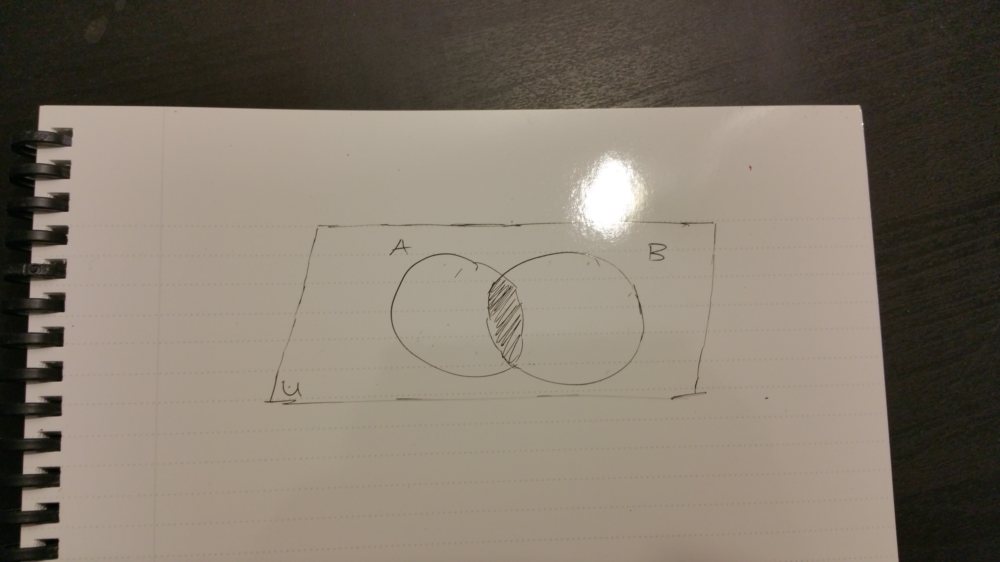
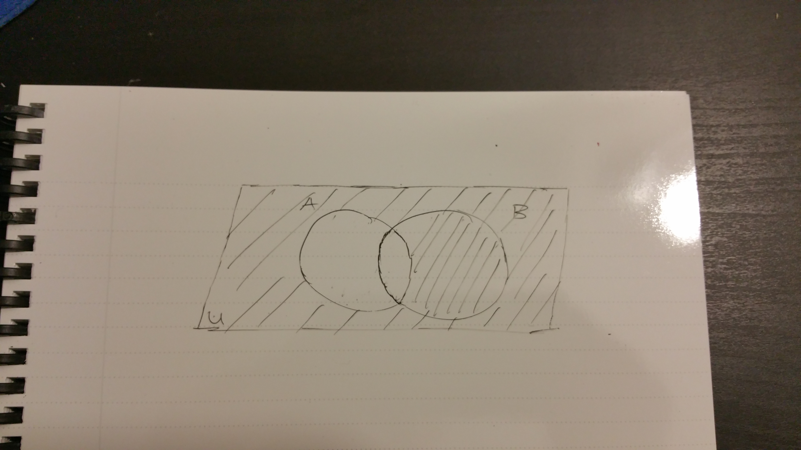
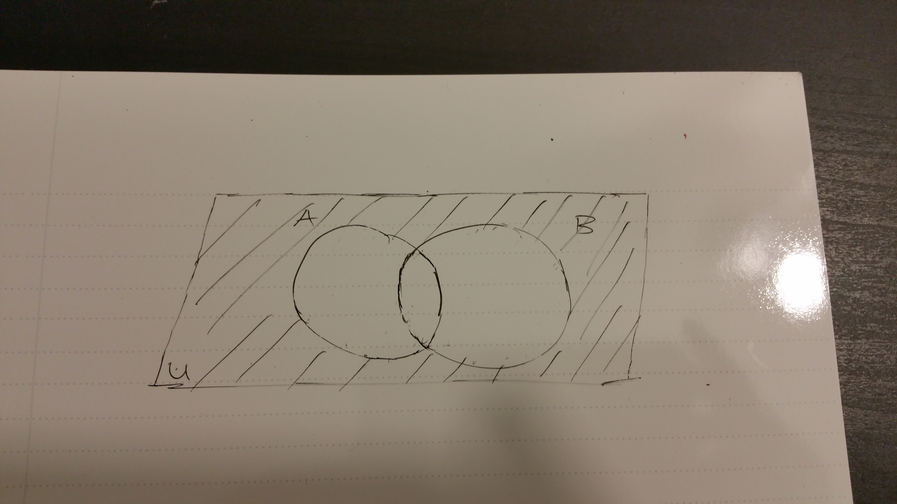
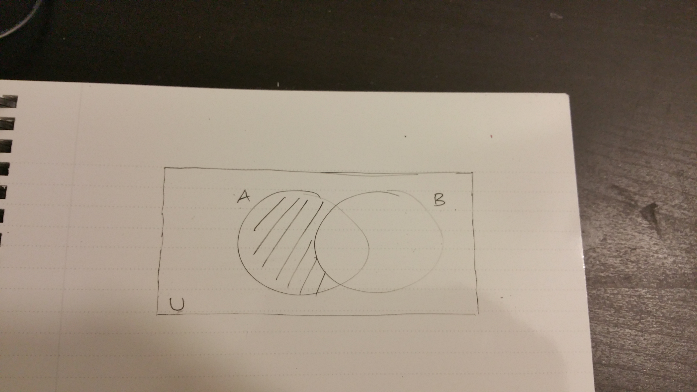
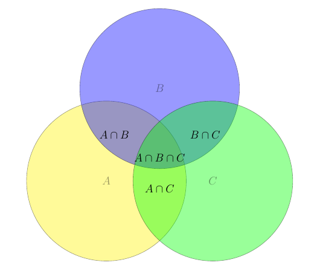

&nbsp;

Hi there. This is part two of my three part series to An Introduction to Set Theory and Logic.

Part One of this introduction talked about definitions, notation with some examples. The number system was also covered.

Here in Part Two, Venn diagrams will help with understanding relations between sets.

Part Three will go into more detail about set operations and counting with sets.

&nbsp;

---

**Note**

Aside from the featured image a few other images, the images of Venn diagrams were hand drawn by me. Yes I drew parallelograms instead of rectangles but the idea is there. The images are from my camera phone.

&nbsp;

---

### <u>Table Of Contents</u>

&nbsp;

* Applications of Set Theory
* Venn Diagrams
* The Universe of Discourse
* Unions
* Intersections
* Complements
* Subtracting Sets and Relative Complements
* Symmetric Difference
* Summary and Visual Aid
* References

&nbsp;

### <u>Applications of Set Theory</u>

Set Theory is one of the foundational topics of (pure) mathematics. Knowing set theory will also help for computer science students when dealing with booleans such as (True or False) and (!False) which is True. Set Theory also helps with SQL database queries when dealing with table joins.

&nbsp;

### <u>Venn Diagrams</u>

Consider an elementary student in gym class of 25 students with large hula hoops laid on the floor. The teacher would lay the hula hoops on the floor in a manner like this:

&nbsp;

&nbsp;

The teacher would say something along the lines of `If you like chocolate ice cream, step inside the hula hoop A`, `If you like vanilla ice cream, step inside the hula hoop B`, `If you like both chocolate and vanilla ice cream, step inside both hula hoops.`, `If you do not like vanilla or chocolate ice cream , do not step inside any of the two hula hoops.''`

This simple example illustrates the usefulness of Venn diagrams to visualize two sets. Venn diagrams for three sets is possible and anything past three sets is difficult to visualize as it is more abstract and confusing. Here is what three sets would look like.

&nbsp;

### <u>The Universe of Discourse ($U$)</u>

Notice that we have a rectangle and space that is outside the sets $A$ and $B$ but is still in the rectangle. The set $U$ is defined as the universal of discourse as is represented by a rectangular region. Subsets of $U$ are represented by circles or the sets within it.

As an example, suppose that we have a class size of 30 students. We can define the universe of discourse $U$ as the 30 students. Within the 30 students, we have male and female students. One set can represent the male students out of the 30 in the class. The second set can represent the female students in the class.

Another example would be food group of vegetables as $U$. Celeries, broccoli, carrots, mushrooms, lettuce, okras belong to the vegetable family. One possible set would be mushrooms and the type of mushrooms would be elements in that set. Another possible set would be lettuce and the types of lettuce would be elements in that set.

&nbsp;

### <u>Unions</u>

Given the sets $A$ and $B$, the union of sets $A$ and $B$ is denoted by $A \cup B$. The union $A \cup B$ is a set which contains elements in $A$ or in $B$. Defined mathematically, it is defined as $A \cup B = \{x: x \in A \text{ or } x \in B\}$. The math notation reads as ``A union B" and ``element x such that x is in set A or x is in set B".

The word or here does not mean one or the other like in English. In the math and logic sense, the word or means one of three options in $A \cup B$.

&nbsp;

1) The element $x$ can be in $A$.
2) The element $x$ can be in $B$.
3) The element $x$ can be in $A$ and in $B$.

&nbsp;

For two sets the dashed region represents the elements inside the union $A \cup B$ looks like this:

&nbsp;

&nbsp;

For three sets, the Venn diagram looks like this.

&nbsp;

&nbsp;

Here are some examples with unions.

**Example One**

Suppose we are given set $A = \{beans, carrots, pomelo, mushrooms\}$ and set $B = \{leeks, carrots, celery, beans\}$. The union of the two sets $A \cup B$ would be

&nbsp;

$$\displaystyle \begin{array} {lcl} A \cup B & = & \{beans, carrots, pomelo, mushrooms, leeks, carrots, celery, beans \} \\ & = & \{beans, carrots, pomelo, mushrooms, leeks, celery\} \\ \end{array} $$

&nbsp;

Recall that elements in a set are unique. There are no multiples in a set. The double counts of beans and celery are reduced to a single count for each.

&nbsp;

**Example Two**

&nbsp;

Suppose we are given sets $A = \{1, 5, 7, 11\}$, $B = \{0, -2, 8, 7, 5\}$ and $C = \{1, 2, 8, -2\}$. The union of the three sets $A \cup B \cup C$ would be

&nbsp;

$$\displaystyle \begin{array} {lcl} A \cup B \cup C & = & \{1, 5, 7, 11\} \cup \{0, -2, 8, 7, 5\} \cup \{1, 2, 8, -2\} \\ & = & \{1, 5, 7, 11, 0, -2, 8, 7, 5, 1, 2, 8, -2\}\\ & = & \{1, 5, 7, 11, 0, -2, 8, 2\}\\ \end{array} \\ $$

&nbsp;

### <u>Intersections</u>

&nbsp;

We have somewhat introduced the concept of intersection in the previous section. The intersection of set A and set B (read ``A intersect B") is defined as $A \cap B = \{x: x \in A \text{ and } x \in B\}$.

The word and in the math context does match with the English version of and.

With the two sets, the intersection $A \cap B$ is represented by the shaded area (middle) in the visual below.

&nbsp;

&nbsp;

One can notice that the intersection $A \cap B$ is a subset of set $A$ (i.e. $A \cap B \subseteq A$) and $A \cap B$ is a subset of set $B$ ($A \cap B \subseteq B$).

A Venn diagram of three sets with $A \cap B \cap C$ (middle shaded part) looks like this.

&nbsp;

&nbsp;

---

**Empty Intersection Case**

&nbsp;

There are cases where there is no element that belongs to both sets $A$ and $B$. In these cases, we say that the intersection $A \cap B$ is empty or disjoint. The intersection of such disjointed sets is denoted by $A \cap B = \varnothing$.

The visual below shows the shaded $A$ region and the shaded $B$ region but the middle intersection being unshaded representing an empty intersection.

&nbsp;

&nbsp;

An empty intersection of three sets would have the middle intersection part being empty $A \cap B \cap C$.

&nbsp;

&nbsp;

---

Here are a few examples with intersections.

**Example One**

&nbsp;

Suppose we are given the set $A= \{apples, guava, jack fruit, pineapple\}$ and the set $B =\{grapes, mango, pineapple, orange\}$. The intersection of the two sets would be $A \cap B = \{pineapple\}$.

&nbsp;

**Example Two**

&nbsp;

The intersection of the set $P = \{1, 9, 3\}$ and $Q = \{2, 10, 3, 18, 8, 1, 5\}$ is $\{1, 3\}$.

&nbsp;

**Example Three**

&nbsp;

The positive integers or natural numbers $\mathbb{N} = \{1, 2, 3, \dots \}$ and the negative integers $\mathbb{Z^{-}} = \{-1, -2, -3, \dots \}$ are disjoint sets. (The intersection between the two sets is empty.) There is nothing in common between the two sets.

&nbsp;

**Example Four**

&nbsp;

Suppose we have a set A with the U as the universe of discourse. The set U can be split or partitioned into $A \cup A^{c}$ such that the intersection $A \cup A^{c} = \varnothing$.

&nbsp;

### <u>Complements</u>

&nbsp;

In English, the word complement relates to an item that goes well with another item. In the math context a complement refers to an opposite. Given a set $A$, the complement of the set $A$ is the set of all elements that are not in $A$ denoted by $A^{c}$ or $A'$ or $\bar{A}$.

In math notation, we write $A^{c} = \{x: x \in A^{c}\} = \{x: x \notin A\}$

For a better understanding of complements, we have visuals below.

In this visual, we have $A^{c}$. Notice how the intersection $A \cap B$ is not shaded. It is because $(A \cap B) \subseteq A$, so the intersection is not included in the complement of set $A$.

&nbsp;

&nbsp;

In the next visual, we have $B^{c}$. Again, since the intersection is a subset of set $B$ it is not shaded.

&nbsp;

&nbsp;

In this visual, we have $(A \cup B)^{c}$. Neither set A, set B nor the intersection is shaded here.

&nbsp;

&nbsp;

**Complements With Three Sets**

&nbsp;

Dealing with complements with more than 2 sets is tricky. The visuals get complicated too. An example of a three set case is where we have $(A \cup B \cup C)^{c}$. The shaded regions outside of sets $A$, $B$ and $C$ represents the elements in the complement of $(A \cup B \cup C)$.

&nbsp;

&nbsp;

**Example One**

&nbsp;

The complement of the set of even numbers is the set of odd numbers.

&nbsp;

**Example Two**

&nbsp;

The complement of the set of prime numbers is the set of non-prime numbers.

&nbsp;

**Example Three**

&nbsp;

Given that the universe of discourse $U$ is the set of all integers $\mathbb{Z} = \{0, \pm1, \pm2, \pm3, \dots \}$. The complement of the negative integers $\mathbb{Z^{-}} = \{-1, -2, -3, \dots \}$ is the set of positive integers and zero.

&nbsp;

### <u>Subtracting Sets and Relative Complements</u>

&nbsp;

Relative Complements can be thought of subtracting sets. Subtraction with sets is not exactly like $7 - 2 = 5$ but there are a few similarities with subtracting numbers and subtracting sets.

Given that we have two sets $A$ and $B$, the set $A - B$ or $A \setminus B$ is $A \cap B^{c}$. This relative complement means that we have the intersection of set $A$ and the complement of $B$. In math notation we write 

$$A \setminus B = A \cap B^{c} = \{x: x \in A \text{ and } x \in B^{c}\} = \{x: x \in A \text{ and } x \notin B\}$$ 

The visual below is for reference.

&nbsp;

&nbsp;

The symmetric difference $B - A$ or $B \setminus A$ is $B \cap A^{c}$ which is shown below.

&nbsp;

&nbsp;

**Three Sets Case**

&nbsp;

The case for three sets is tricky. Only a few examples will be covered.

Given the sets $A$, $B$ and $C$. The set $B - (A \cup C) = B \setminus (A \cup C) = B \cap (A \cup C)^{c}$ is only the set $B$. It would look like this.

&nbsp;

&nbsp;

A more involved example would be the set $(A \cup C) - (A \cap C) - B = (A \cup C) \setminus (A \cap C) \setminus B = (A \cup C) \cap (A \cap C)^{c} \cap B^{c}.$ This means that from the union of sets $A$ and $C$ remove the intersection of $(A \cap C)$ and remove anything from set $B$. A visual below will help.

&nbsp;

&nbsp;

**Example One**

&nbsp;

Suppose we have the sets $A = \{9, 4, -1, 0, 2, 5\}$ and $B = \{2, 0, 1\}$. The universe of discourse $U$ is $\{-1, 0, 1, 2, 3, 4, 5, 6, 7, 8, 9\}$. The set $A \setminus B = A \cap B^{c}$ would be \{9, 4, -1, 5\}. A more detailed answer is below.

&nbsp;

$$\displaystyle \begin{array} {lcl} A \setminus B & = & \{9, 4, -1, 0, 2, 5\} \setminus \{2, 0, 1\} \\ & = & \{9, 4, -1, 0, 2, 5\} \cap \{2, 0, 1\}^{c} \\ & = & \{9, 4, -1, 0, 2, 5\} \cap \{-1, 3, 4, 5, 6, 7, 8, 9\} \\ & = & \{9, 4, -1, 5\}\\ \end{array} \\ $$

&nbsp;

**Example Two**

&nbsp;

Suppose we have the sets $A = \{10, 2, -2, 0, 7\}$, $B = \{1, 2, 3\}$ and $C= \{5, 0\}$. The set $A \setminus B \setminus C= A \cap B^{c} \cap C^{c}$ would be $\{10, -2, 7\}$.

&nbsp;

### <u>Symmetric Difference</u>

The symmetric difference of sets is somewhat tricky. It does involve relative complements as discussed in the previous section.

We deal with the two sets case first. Suppose we have sets $A$, $B$ and the universe of discourse $U$. The symmetric difference of $A$ and $B$ which is denoted by $A \triangle B$ is defined as :

&nbsp;

$$\displaystyle \begin{array} {lcl} A \triangle B & = & (A - B) \cup (B - A) \\ & = & (A \cap B^{c}) \cup (B \cap A^{c})\\ \end{array} \\ $$

&nbsp;

One could also view $A \triangle B$ as $A \triangle B = (A \cup B) - (A \cap B)$.

Here is a visual for two sets where the intersection in the middle is not shaded. (Bad picture quality sorry).

&nbsp;

&nbsp;

For three sets, it is not as simple as removing the intersections. If we have $A \triangle B \triangle C$, it would look like this.

&nbsp;

&nbsp;

**Example One**

&nbsp;

Suppose we have sets $R = \{1, 9, 8, 0\}$ and $S = \{8, 2, 4\}$. The symmetric difference of sets $R$ and $S$ is:

&nbsp;

$$\displaystyle \begin{array} {lcl} R \triangle S & = & \{1, 9, 8, 0\} \triangle\{8, 2, 4\} \\ & = & \{1, 9, 0, 2, 4\}\\ \end{array} \\ $$

**Example Two**

&nbsp;

Given three sets $A = \{4, 5, 2, 0, 1\}$, $B = \{1, -2, 5, 9\}$ and $C = \{3, 7, 1, 0\}$. What is $A \triangle B \triangle C$?

We first determine the intersections.

$$A \cap B = \{5, 1\}$$

$$A \cap C = \{1, 0 \}$$

$$B \cap C = \{1\}$$

$$A \cap B \cap C = \{1\}$$

&nbsp;

Therefore $A \triangle B \triangle C = \{4, 2, 1, -2, 9, 3, 7\}$ where the 0 and 5 is taken out.

&nbsp;

### <u>Summary and Visual Aid</u>

That was a lot to handle! To help put everything together, here is a colourful diagram for the case of three sets $A$, $B$ and $C$.

&nbsp;

&nbsp;

To grasp these set theory concepts, try drawing Venn diagrams on paper and see the relations between sets.

Part three will discuss the algebra of sets, the duality of sets, counting with sets, ordered pairs and Cartesian products.

&nbsp;

### <u>References</u>

&nbsp;

The featured image is from http://gatecse.in/wp-content/uploads/2015/06/Venn_Diagram.jpg.

The material was from a coursepack book from a math course I took back in Winter 2010. The course was called An Introduction To Mathematical Proofs

The three set Venn diagram in the beginning is from http://www.cwladis.com/clip_image011_0017.gif

These websites were helpful for guides in making Venn diagrams and for visuals:

* ftp://ftp.dante.de/tex-archive/macros/latex/contrib/venndiagram/venndiagram.pdf
* http://tex.stackexchange.com/questions/26096/tikz-labelling-venn-diagram
* http://users.ju.edu/hduong/math220/venn_diagrams.pdf
* http://tex.stackexchange.com/questions/9681/how-to-draw-venn-diagrams-especially-complements-in-latex
* http://users.ju.edu/hduong/math220/venn_diagrams.pdf
* http://www.texample.net/tikz/examples/venn-diagram/